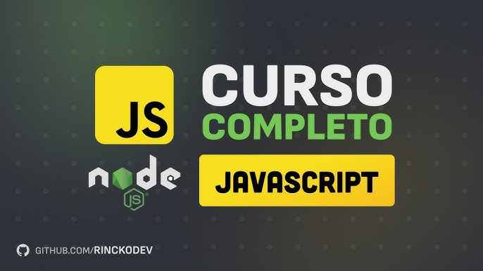
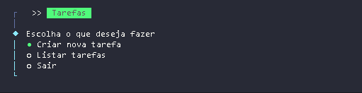
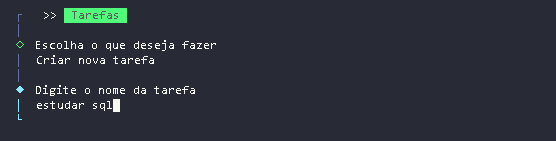
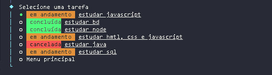
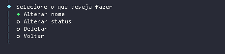

**PROJETO "Mini Programa de Tarefas" (Rincko Dev)**

**O PROJETO**

O projeto apresenta um menu de gerenciamento de tarefas, permitindo ao usuário adicionar, listar e deletar, além de atualizar os status e nomes. 
A execução ocorre pelo terminal, utilizando o comando `npm start`. Será apresentado o menu de opções, bastando navegar pelas setas do teclado e pressionar "Enter" para selecionar a ação que deseja executar.

Projeto realizado em: 12/02/2026.

**Tecnologias**

- Linguagem de desenvolvimento: JavaScript
- Ambiente de execução: NodeJs
- Bibliotecas: 
    - @clack/prompts: pacote para criar interfaces de linha de comando (CLIs) bonitas, minimalistas e interativas em JavaScript/TypeScript/Node.js (comando para instalar: `npm install @clack/prompts` )
    - Chalk: módulo popular para Node.js usado para adicionar cores e estilos à saída do terminal com facilidade (comando para instalar: `npm install chalk`)

**Ferramenta de desenvolvimento**

- Visual Studio Code (VS Code)
- NodeJs

**Canal Rincko Dev**

[PlayList do Curso JavaScript em NodeJs](https://www.youtube.com/watch?v=lQAJ-T1QTYc&list=PL9tY_tDo_Q0C0hs1aGgtJbEH1EBlyzZdG&index=1)